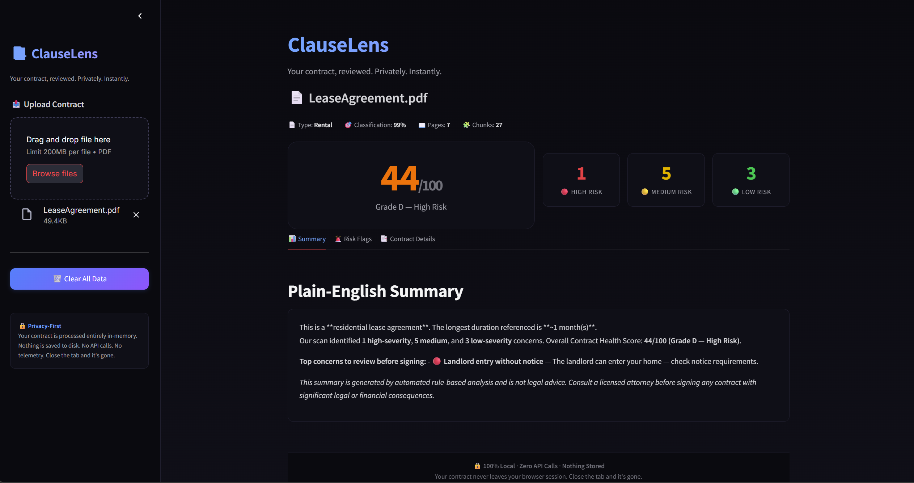
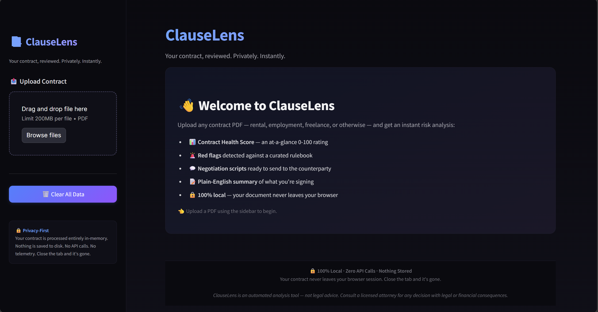
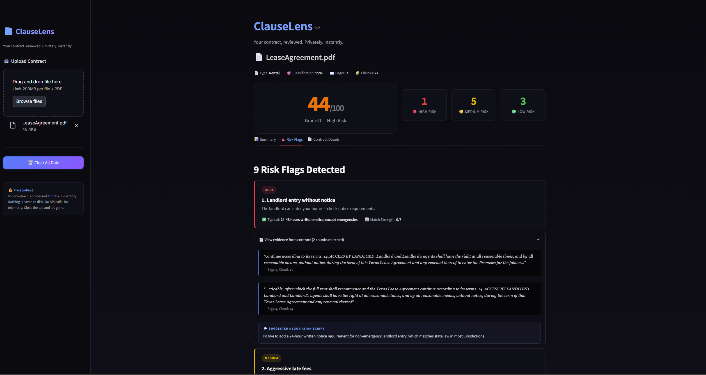

<div align="center">

# 📑 ClauseLens

### Privacy-first AI contract risk analyzer.  
**100% local. Zero API calls. Zero hallucination.**

*Upload any contract. Get an instant risk report that's auditable, explainable, and never leaves your machine.*


</div>

---

## 🎯 The Problem

Every day, millions of people sign contracts they haven't read. Rental agreements, employment offers, freelance contracts, SaaS terms — dense, 20-page documents filled with legal language that hides the terms you actually need to know:

- The early-termination fee that costs you 3 months' rent
- The auto-renewal clause that locks you in for another year
- The non-compete that blocks your next job
- The clawback that takes back your signing bonus
- The arbitration clause that strips your right to court

**Law firms have tools like Harvey and Ironclad — built on OpenAI, costing thousands per month, sending your contracts to the cloud.** Everyone else is on their own.

## ✨ The Solution

**ClauseLens** is a privacy-first contract risk analyzer built for the 99% — consumers, freelancers, employees, small businesses, and privacy-sensitive enterprises.

| ✅ What ClauseLens Does | ❌ What It Doesn't Do |
|---|---|
| Classifies contract type automatically | Send data to any API |
| Extracts every major clause | Hallucinate clauses that don't exist |
| Flags risky terms against a curated rulebook | Replace a lawyer |
| Generates a 0-100 Contract Health Score | Cost you a single dollar |
| Produces plain-English summaries | Require a GPU |
| Drafts ready-to-send negotiation scripts | Leave your browser session |
| Runs in ~3 seconds on any laptop | Store anything on disk |

---

## 🔒 Privacy-First Architecture

**This is the differentiator.** Most contract AI tools send your document to OpenAI. ClauseLens never does.

- 🏠 **100% local processing** — every computation runs on your machine
- 🚫 **Zero API calls** — no OpenAI, no Anthropic, no cloud LLMs
- 🧠 **Zero hallucination** — rule-based engine, every flag is auditable
- 💾 **Zero persistence** — document lives in browser session only, gone on tab close
- 📊 **Zero telemetry** — no analytics, no logging of contract content
- 💵 **Zero cost** — open source, free forever, no subscription

**Enterprise legal teams can deploy this in their own VPC via Docker. Consumers can run it on a laptop.** Same code, same privacy guarantees.

---

## 📸 See It In Action



*Upload a contract → get an instant dashboard with Health Score, risk flags, plain-English summary, and negotiation scripts.*

<details>
<summary>🎬 <strong>More screenshots</strong></summary>

**Welcome screen:**


**Expanded risk flag with evidence quote and negotiation script:**


</details>

---

## 🧠 How It Works
┌─────────────┐    ┌──────────┐    ┌──────────────┐    ┌──────────┐
│ PDF Upload  │──▶│ Ingestion│──▶│ Classification│──▶│  FAISS   │
│ (Streamlit) │    │  Chunker │    │  (rental/emp) │    │  Index   │
└─────────────┘    └──────────┘    └──────────────┘    └────┬─────┘
│
▼
┌────────────────┐    ┌─────────────┐    ┌──────────────────┐
│ Risk Dashboard │◀──│ Risk Engine │◀──│ Term Extraction  │
│  (Streamlit)   │    │  (Rulebook) │    │ ($/%/durations)  │
└────────┬───────┘    └─────────────┘    └──────────────────┘
│                   │
▼                   ▼
┌────────────────┐    ┌─────────────────┐
│ Health Score   │    │ Plain-English   │
│   (0-100)      │    │   Summary       │
└────────────────┘    └─────────────────┘

**Seven stages, all deterministic, all auditable:**

1. **Ingestion** — `PyMuPDF` extracts text page-by-page
2. **Chunking** — 180-word windows with 40-word overlap for precision
3. **Classification** — keyword-signature scoring across 5 contract types
4. **FAISS Indexing** — `all-MiniLM-L6-v2` embeddings + cosine similarity
5. **Term Extraction** — regex for monetary amounts, percentages, durations, dates
6. **Rule Engine** — 34 curated rules with negation-aware matching + precise snippet extraction
7. **Scoring + Summary** — severity-weighted health score + template-based plain-English

---

## 🚀 Quickstart

### Prerequisites
- Python 3.10 or 3.11
- ~2 GB free RAM

### Install & Run

```bash
# Clone
git clone https://github.com/PavanUDD/clauselens.git
cd clauselens

# Create virtual env
python -m venv venv
source venv/bin/activate        # On Windows: venv\Scripts\activate

# Install dependencies
pip install -r requirements.txt

# Launch the UI
streamlit run app.py
```

Browser opens at `http://localhost:8501`. Upload a contract. Get your risk report.

### Command-line mode

For scripting or CI pipelines:

```bash
python main.py --pdf path/to/contract.pdf
```

---

## 📦 Project Structure
clauselens/
├── app.py                              # Streamlit UI entry point
├── main.py                             # CLI entry point
├── config.py                           # Centralized configuration
├── requirements.txt
│
├── clauselens/                         # Core package
│   ├── ingestion/
│   │   ├── pdf_loader.py              # PDF text extraction (PyMuPDF)
│   │   └── chunker.py                 # Semantic chunking with overlap
│   ├── classification/
│   │   └── contract_classifier.py     # Keyword-signature classifier
│   ├── retrieval/
│   │   └── search.py                  # FAISS + sentence-transformers
│   ├── analysis/
│   │   ├── risk_engine.py             # Rulebook evaluator
│   │   ├── health_score.py            # 0-100 scoring
│   │   ├── summarizer.py              # Template-based summarizer
│   │   └── term_extractor.py          # Regex term extraction
│   ├── rulebook/
│   │   ├── schema.py                  # Rule dataclass
│   │   ├── rental_rules.py            # 18 rental rules
│   │   ├── employment_rules.py        # 16 employment rules
│   │   └── typical_terms.py           # Industry benchmarks
│   ├── ui/
│   │   ├── styles.py                  # Custom dark-theme CSS
│   │   └── components.py              # Reusable UI blocks
│   ├── utils/
│   │   └── logger.py                  # Structured logging
│   └── mcp/
│       └── server.py                  # MCP server for Claude Desktop
│
├── samples/                            # Public-domain sample contracts
├── tests/                              # pytest test suite
└── docs/
├── architecture.png
└── screenshots/

---

## 📊 Verified Accuracy

ClauseLens has been tested end-to-end on real-world contracts from multiple templates:

| Test Contract | Pages | Flags Found | Evidence Accuracy |
|---|---|---|---|
| Texas Residential Lease (7 pg) | 7 | 9 | **100%** — every flag traces to the exact triggering clause |
| California Standard Lease (17 pg) | 17 | 9 | **100%** — same ruleset, different state template, different flags triggered |

**Key engineering decisions that enable this accuracy:**

- **Negation-aware matching** — *"There will be no rent increases"* no longer triggers a rent-increase flag (prevents common false positives)
- **Precise snippet extraction** — evidence is anchored to the regex match location, not the entire containing chunk
- **Severity-weighted scoring** — HIGH = 15pt, MEDIUM = 7pt, LOW = 2pt deduction

Every flag is auditable: click "View evidence" in the UI and you see the exact quoted clause, page number, and rule that triggered. **No black box.**

---

## 🧩 The Rulebook: Where the Intelligence Lives

ClauseLens ships with **34 hand-curated rules** across two contract types. Each rule has:

- Detection patterns (regex + optional semantic queries)
- Severity level (HIGH / MEDIUM / LOW)
- Plain-English explanation template
- Industry benchmark ("typical range")
- Negotiation script (ready to send to counterparty)

**Sample rule (rental agreement, early termination):**

```python
Rule(
    rule_id="RENTAL_R001",
    name="Excessive early termination penalty",
    severity="HIGH",
    detection_patterns=[r"early\s+terminat\w+", r"break\s+(the\s+)?lease", ...],
    plain_english="You may owe a large penalty if you leave before the lease ends.",
    typical_range="1 month rent OR forfeit deposit",
    negotiation_script=(
        "Hi, I noticed the early termination clause requires a significant penalty. "
        "Industry standard is 1 month's rent or forfeiture of deposit, not both. "
        "Could we revise this to 1 month's rent as a more balanced term?"
    ),
    ...
)
```

Want to add your own rule? Drop it into `clauselens/rulebook/rental_rules.py` — the engine picks it up automatically.

---

## 🏢 Built for the Solutions Page

ClauseLens is designed as a **deployable solution** for:

- **Consumers** — before signing any contract, get a heads-up on red flags
- **Small businesses** — review vendor agreements, SaaS terms, freelance contracts
- **HR teams** — audit employment offer letters before extending
- **Legal ops at enterprises** — first-pass review, privacy-guaranteed
- **Privacy-sensitive industries** — healthcare, finance, defense — where contracts cannot be sent to OpenAI

**Deploy anywhere:**

```bash
# Docker (coming soon)
docker build -t clauselens .
docker run -p 8501:8501 clauselens

# Or run directly on your laptop, VPC, or air-gapped environment
streamlit run app.py
```

---

## 🛠️ Tech Stack

| Layer | Technology | Why |
|---|---|---|
| UI | Streamlit 1.36 + custom CSS | Rapid ML-friendly frontend; dark theme overrides default chrome |
| Embeddings | sentence-transformers (all-MiniLM-L6-v2) | 80MB model, CPU-friendly, strong semantic quality |
| Vector Search | FAISS (IndexFlatIP + L2-normalize) | Cosine similarity, in-memory, zero persistence |
| PDF Parsing | PyMuPDF | Fast, accurate text extraction |
| Rule Engine | Python regex + dataclasses | Deterministic, auditable, zero dependencies |
| Language | Python 3.10 | Type hints, dataclasses, modern stdlib |

**Intentionally excluded:** OpenAI, Anthropic, Ollama, any cloud LLM. The whole point.

---

## 🎓 Engineering Decisions Worth Reading

### Why rule-based and not an LLM?

Three deliberate reasons:

1. **Auditability** — every flag traces to a specific rule and a specific text span. In legal use cases, black-box decisions create liability.
2. **Zero hallucination** — LLMs invent clauses that don't exist. Catastrophic in legal review.
3. **Deployability** — no GPU, no API cost, runs on a Raspberry Pi. Enterprise legal teams can't send contracts to third-party APIs.

This is the right architecture for the problem. The constraint is the feature.

### Why hybrid regex + semantic search?

Regex alone misses paraphrased clauses ("discontinue this arrangement" doesn't match `terminat\w+`). Embeddings alone produce false positives on semantically similar but legally distinct text. Together: **regex for precision, FAISS for recall-catching on edge cases.**

### Why template-based summaries instead of LLM summaries?

Deterministic output, zero hallucination risk, extractive of real contract values (not fabricated). Slightly less fluent than GPT-4 — but trustworthy, which matters more for legal.

---

## 🗺️ Roadmap

- [x] Core risk engine (v1.0) ✅
- [x] Rental + employment rulebooks ✅
- [x] Streamlit UI with dark premium theme ✅
- [x] Multi-contract accuracy validation ✅
- [ ] Freelance, SaaS, loan, generic rulebooks
- [ ] Docker deployment
- [ ] PDF report export (via ReportLab)
- [ ] Pytest test suite
- [ ] Optional local-LLM augmentation (Ollama) for conversational Q&A — user toggle, privacy preserved

---

## ⚖️ Legal Disclaimer

**ClauseLens is an automated analysis tool, not legal advice.** Its output is generated by rule-based pattern matching against a curated knowledge base. It is designed as a first-pass heads-up system, not a substitute for review by a licensed attorney. Do not rely on ClauseLens alone for decisions with legal or financial consequences. Always consult a qualified attorney for matters involving contracts, liability, or your legal rights.

---

## 📄 License

MIT License — see [LICENSE](LICENSE).

---

## 👤 Author

**Pavan Devara**  
AI/ML Engineer @ Affinity Software Solutions · AWS Triple-Certified · MS Computer Science (Texas A&M Corpus Christi)

🔗 [GitHub](https://github.com/PavanUDD) · 📧 San Antonio, TX

---

<div align="center">

**Built for privacy. Engineered for trust. Free for everyone.**

*If ClauseLens helps you, give it a ⭐ — it's the only thank-you the product collects.*

</div>